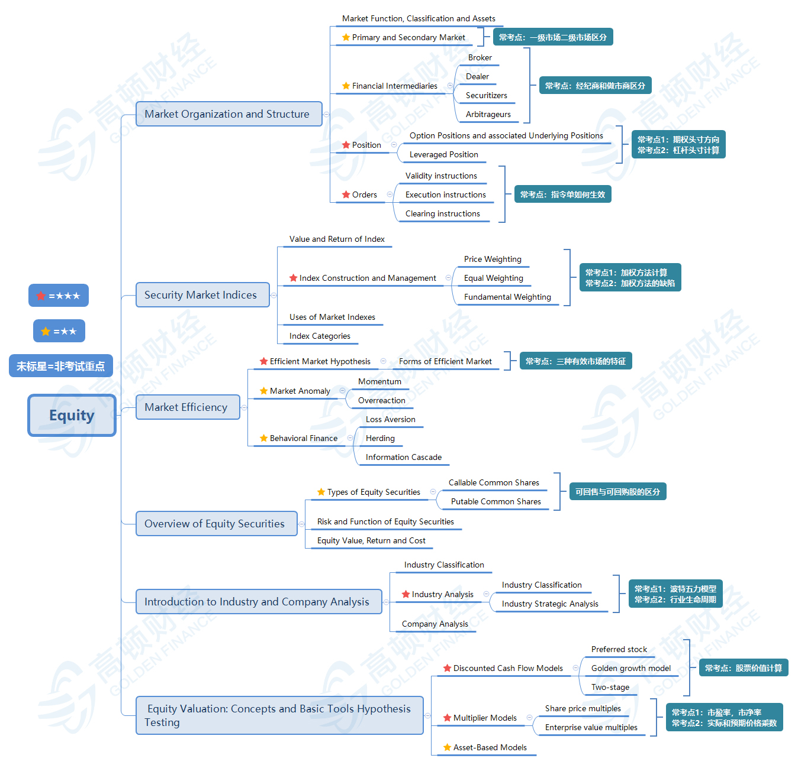

# Analysis of Equity Investment

- Reading 36 - Market Organization and Structure
- Reading 37 - Security Market Indexes
- Reading 38 - Market Efficiency
- Reading 39 - Overview of Equity Securities
- Reading 40 - Introduction to Industry and Company Analysis
- Reading 41 - Equity Valuation: Concepts and Basic Tools

