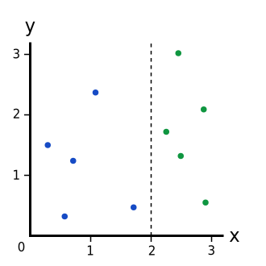

# A Simple Explanation of Information Gain

> * Author: [Damon Yuan](https://www.damonyuan.com)
> * Date: 2019-10-14

When construct a Decision Trees, we need to choose to split our dataset in a way that **makes our unorganized data more organized**, but how can we quantify that?

There are multiple ways to do this, and each has its own advantages and disadvantages. One way to measure the messiness is to using Gini Impurity, as mentioned in [A Simple Explanation of Gini Impurity](https://victorzhou.com/blog/gini-impurity/).

However here we are going to use another way, using Information Gain from [ID3 algorithm](https://en.wikipedia.org/wiki/ID3_algorithm).

## Information Gain

Information Gain is the measure of the difference in Entropy from before to after the set S is split on an attribute A. In other words, how much uncertainty in S was **reduced** after splitting set S on attribute A, the more uncertainty reduced the better the split is. the formula is defined as follow,

$$
  IG(S, A) = H(S) - \sum_{t\in T}p(t)H(t) = H(S) - H(S\|A)
$$  

  Where,

  * H(S) – Entropy of set S
  * T - The subsets created from splitting set S by attribute A, such that $$S = \bigcup_{t\in T}t$$ 
  * p(t) - The proportion of the number of elements in t to the number of elements in set S
  * H(t) - Entropy of subset t

When we know how to calculate the Information Gain, we can split our data across every feature of the classes to see which split gives us the highest Information Gain. The split with the highest Information Gain is our best option.

Before we can measure the best split and start splitting our data, we need to know how to calculate the Information Gain. The measure of information of a set is known as the **Shannon Entropy**, or just **Entropy** for short. Its name comes from the father of information theory, Claude Shannon. Entropy is a measure of the amount of uncertainty in the data set S. The higher the Entropy, the more mixed up the data is.

The formula for the calculation of Entropy is defined as

$$
H(S) = -\sum_{x_i\in X, i = 1}^Np(x_i)log_2p(x_i)
$$

  Where,

  * S - The current dataset for which Entropy is being calculated
  * X - The set of classes in S 
  * $$ p(x) $$ - the proportion of the number of elements in class x to the number of elements in Set S 
  * $$ log_2p(x) $$ - the information for class x
  * N is the number of classes
  
After the formula of Entropy is defined, we can start to calculate the Information Gain for some simple examples.   

## Examples

Training a decision tree consists of iteratively splittin gthe current data into two branches. Say we had the following data points: 


Right now, we have 1 branch with 5 blues and 5 greens. We can build a model for each points using the following data structure,

```
[x, y, color]
```
Where x coordinate and y coordinate are the attributes of color class.

In this way, the whole dataset can be represented by

```
[[0.3, 1.5, blue], 
 [0.6, 0.3, blue], 
 [0.8, 1.2, blue],
 [1.2, 2.3, blue],
 [1.7, 0.4, blue],
 [2.3, 1.7, green],
 [2.4, 3.0, green],
 [2.5, 1.3, green],
 [2.9, 2.1, green],
 [2.9, 0.5, green]]
```

### Example 1: The Whole Dataset

Let's calculate the Information Gain of our entire dataset. 

1. Calculate the Entropy of the whole dataset

   $$\begin{aligned} H(S) &= -\sum_{x_i\in X, i = 1}^2p(x_i)log_2p(x_i) \\
  &= -p(blue)log_2p(blue) - p(green)log_2p(green) \\
  &= -{5\over10} \times log_2{5\over10} - {5\over10} \times log_2{5\over10} \\
  &= -{1\over2} \times log_2{2^{-1}} - {1\over2} \times log_2{2^{-1}} \\
  &= 1 \end{aligned} $$

2. Calculate the Information Gain based on the definition

   Note that here is only one branch in the whole dataset, which leads to the result 

   $$\begin{aligned} IG(S, A) &= H(S) - \sum_{t\in T}p(t)H(t) \\
  &= H(S) - H(S) \\
  &= 0 \end{aligned} $$

### Example 2: A Perfect Split

Let's make a split at x = 2:



This is a perfect split since it breaks our dataset perfectly into two branches:

  * Left branch, with 5 blues.
  * Right branch, with 5 greens.
  
Let's calculate the Information Gain of this split, 

1. Calculate the Entropy of the two branches  

   * Left branch
   
     $$\begin{aligned} H(S_l) &= -\sum_{x_i\in X, i = 1}^2p(x_i)log_2p(x_i) \\
  &= -p(blue)log_2p(blue) - p(green)log_2p(green) \\
  &= -{5\over5} \times log_2{5\over5} - {0\over5} \times log_2{0\over5} \\
  &= -1 \times log_2{2^0} - 0 \times log_2{0} \\
  &= 0 \end{aligned} $$
  
   * Right branch
   
     $$\begin{aligned} H(S_r) &= -\sum_{x_i\in X, i = 1}^2p(x_i)log_2p(x_i) \\
  &= -p(blue)log_2p(blue) - p(green)log_2p(green) \\
  &= -{0\over5} \times log_2{0\over5} - {5\over5} \times log_2{5\over5} \\
  &= -0 \times log_2{0} - 1 \times log_2{2^0} \\
  &= 0 \end{aligned} $$
  
2. Calculate the Information Gain for this split

   $$\begin{aligned} IG(S, A) &= H(S) - \sum_{t\in T}p(t)H(t) \\
  &= H(S) - H(S|x) \\
  &= H(S) - p(S_l)H(S_l) - p(S_r)H(S_r) \\
  &= 1 - {5\over10}\times0 - {5\over10}\times0 \\
  &= 1 \end{aligned} $$
  
  The Information Gain is 1 and it is larger than 0 from Example 1.
   
### Example 3: An Imperfect Split

Let's make a split at x = 1.5:


This imperfect split breaks our dataset into these branches:

  * Left branch, with 4 blues.
  * Right branch, with 1 blue and 5 greens.

Let's calculate the Information Gain of this split,

1. Calculate the Entropy of the two branches  

   * Left branch 
   
     $$\begin{aligned} H(S_l) &= -\sum_{x_i\in X, i = 1}^2p(x_i)log_2p(x_i) \\
  &= -p(blue)log_2p(blue) - p(green)log_2p(green) \\
  &= -{4\over4} \times log_2{4\over4} - {0\over4} \times log_2{0\over4} \\
  &= -1 \times log_2{2^0} - 0 \times log_2{0} \\
  &= 0 \end{aligned} $$
  
   * Right branch
     
     $$\begin{aligned} H(S_r) &= -\sum_{x_i\in X, i = 1}^2p(x_i)log_2p(x_i) \\
  &= -p(blue)log_2p(blue) - p(green)log_2p(green) \\
  &= -{1\over6} \times log_2{1\over6} - {5\over6} \times log_2{5\over6} \\
  &= 0.6500224216483541 \end{aligned} $$
  
     Using python to calculate, the code is as follows
     
     ```
     # Python 3.7
     from math import log
     result =  -(1.0/6)*log(1.0/6, 2) - (5.0/6)*log(5.0/6, 2)
     print(result)
     ```
2. Calculate the Information Gain for this split

   $$\begin{aligned} IG(S, A) &= H(S) - \sum_{t\in T}p(t)H(t) \\
  &= H(S) - H(S|x) \\
  &= H(S) - p(S_l)H(S_l) - p(S_r)H(S_r) \\
  &= 1 - {4\over10}\times0 - {6\over10}\times0.6500224216483541 \\
  &= 0.6099865470109875 \end{aligned} $$
     
   The result is smaller than the 1 from Example 2, so we are sure that it is not the best option to split the dataset.

## Recap

**Information Gain** is the measure of the difference in Entropy from before to after the set S is split on an attribute A, when training a decision tree, the best split is chosen by maximizing the Information Gain, which is calculated by subtracting the weighted Entropy of the branches from the original Entropy. 
