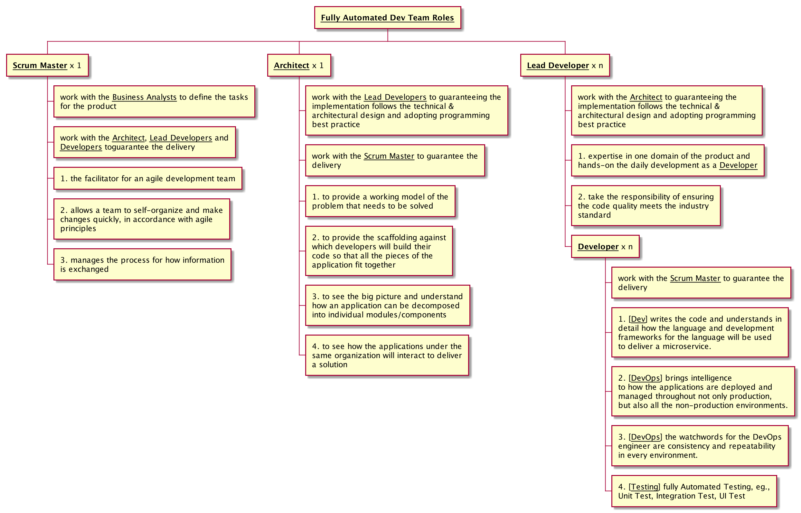
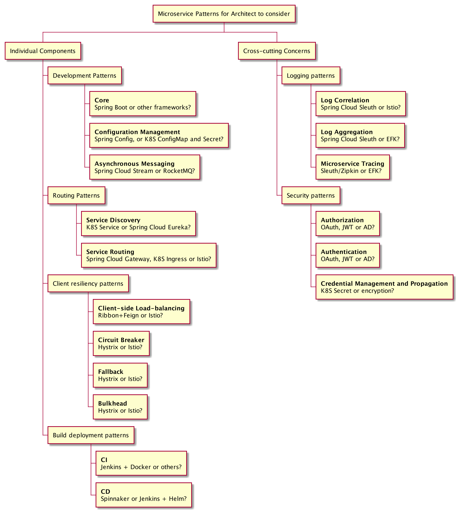
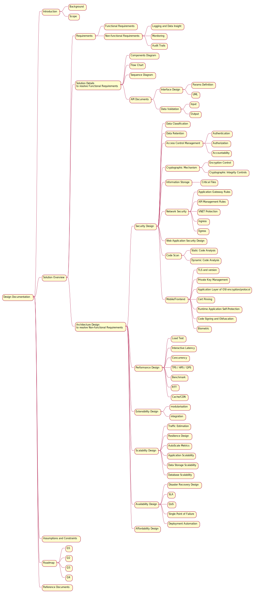

# The Things to Consider as An Architect

> * Author: [Damon Yuan](https://www.damonyuan.com)
> * Date: 2019-10-18

For a fully automated Dev team in an IT company, there normally is a person sitting there as an architect. However sometimes there are always questions popping up about this role, like "what is the difference between an Architect and a Lead Developer", "what is the responsibility for an architect". Here is my understanding of the Architect role along with other roles in a Dev Team, 

The architect’s job is to see the big picture and understand how an application can be decomposed into individual microservices and how the microservices will interact to deliver a solution.

A project’s architect focuses on three key tasks:

  1. Decomposing the business problem

     - Describe the business problem, and listen to the nouns you’re using to describe the problem.
     - Pay attention to the verbs.
     - Look for data cohesion. Microservices should completely own their data.

  2. Establishing service granularity

     - It’s better to start broad with your microservice and refactor to smaller services
     - Focus first on how your services will interact with one another
     - Service responsibilities will change over time as your understanding of the problem domain grows

  3. Defining the service interfaces

If the definition is still obscure and difficult to be understood, I have also prepared some examples here,

## Example One: Before starting a new project

Before starting a project, we need to decide the tech stack for the project, for example, whether to use monolithic pattern or microservice pattern. If the microservice pattern is chosen, an Architect need to consider the following topics before the developers starting to write the code,

It's worthy to mention that the logging system is as important as that of the required functions and should be taken into consideration in the very beginning. One thing I learned from Automation Control Theorem is that a controlled system should always provide the feedback, including the metrics, the logs, and the tracing. It is also very important to have a centric monitoring system to collect, analysis, visualize the data and send alerts when necessary, like ELK/EFK stack, Prometheus with Grafana, etc.

## Example Two: Before adding a new feature to a existing project

When a feature is recommended by a Business Analyst, a design document should be prepare beforehand so that the developers can understand what to do and the Scrum Masters know the exact definition of done. What's more, the documents themselves are also a part of the intellectual property of an company.

Here is a example of design document's structure that should be considered by an Architect,

## Knowledge Map for an JavaEE architect

