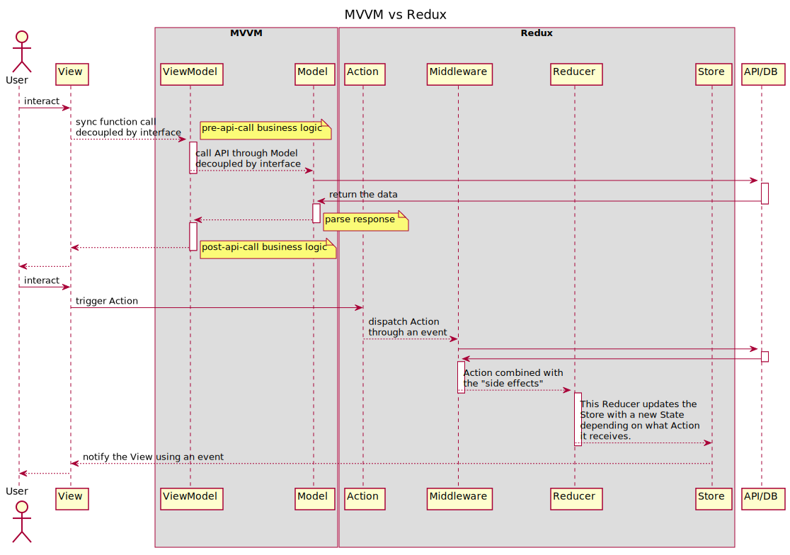

# MVVM vs Redux

> * Author: [Damon Yuan](https://www.damonyuan.com)
> * Date: 2020-02-18
> * Reference: [Introduction to Redux in Flutter](https://blog.novoda.com/introduction-to-redux-in-flutter/)

Most of a pattern in a Framework is designed to decouple the components as much as possible and the ways to achieve it are mainly two, 

  1. using synchronized interfaces
  2. using asynchronized messages

  

  

- IoC: Inverse of Control - "Don't call us, we will call you"
- DI: Dependency Injection
- AOP: Aspect Oriented Programming
   
   With AOP, you still define the common functionality in one place, but you can declaratively define how and where this functionality is applied without having to modify the class to which you’re applying the new feature. Cross-cutting concerns can now be modularized into special classes called aspects. 
   
   This has two benefits. 
   
   - First, the logic for each concern is in one place, as opposed to being scat- tered all over the code base. 
   - Second, your service modules are cleaner because they only contain code for their primary concern (or core functionality), and secondary concerns have been moved to aspects.

