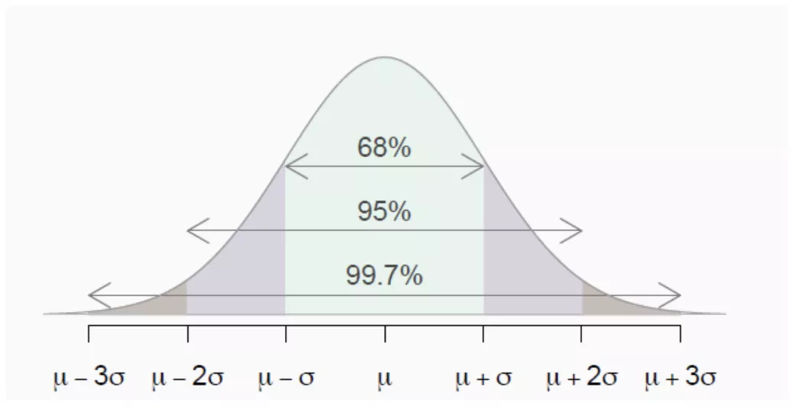
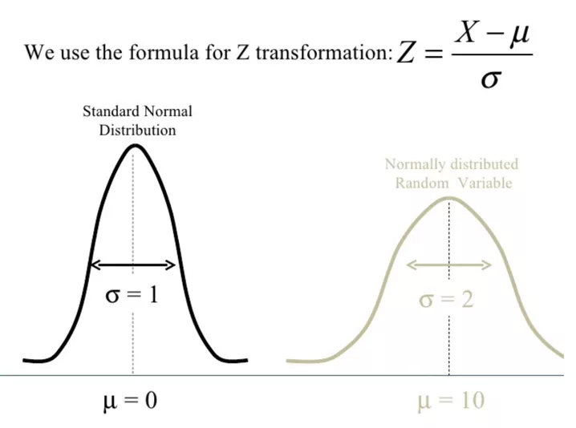

Statistical Significance
=====

Statistical significance is based on a few simple concepts: hypothesis testing, normal distribution and p-value.

The first issue we will discuss is hypothesis testing, a technique that uses data to assess theory. A "hypothesis" is a researcher's initial conjecture about the pre-study situation. This initial theory is referred to as the alternative hypothesis, while the opposite theory is referred to as the null hypothesis.

The testing component of hypothesis testing allows us to determine which hypothesis, the null hypothesis or the alternative hypothesis, is better supported by the evidence. In many hypothesis tests, a method called the z-test is used.

The p-value is the probability of observing an outcome that is at least as extreme as the measured outcome when the null hypothesis is true. The lower the p-value, the more meaningful the result is, as it is less likely to be caused by noise.

Whether the results are statistically significant depends on the significance p-value (called alpha) established before starting the experiment. If the observed p-value is less than alpha, the result is statistically significant. The alpha needs to be chosen before the study because if after the study, one can choose a number to prove that the results are significant, regardless of what the data show!

The choice of α depends on the situation and the field of study, but the most commonly used value is 0.05, which corresponds to a 5% probability that the result is a random occurrence. In usual statistics, the commonly used value is between 0.1 and 0.001. As an extreme example, the physicist who discovered the Higgs boson particle used an alpha value of 0.0000003, or a probability of only 1 in 3.5 million that the particle was discovered due to noise.