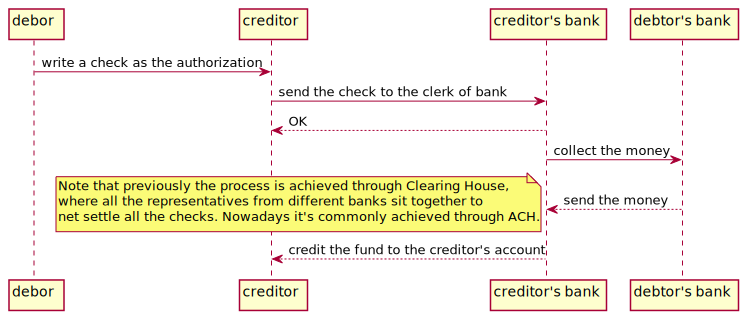

# Payment Systems in Hong Kong

## Overview

Here is just to review what I have learnt from the book and compare the payment systems from Hong Kong with those from US.

One thing quite common in the two territories is that no matter how it evovles, the payment systems can always categorized as pull-basd systems and push-based systems. As to pull-based systems, the payment is initiated by the fund payee, and the fund will be authorized by the payer and then pulled from the payer's fund account; on the other side in push-based systems, the payment is initiated by the payer to send the money to the payee's account.

Worth to mention that in Hong Kong, the authority to governance the monetary markets is [HKMA](https://www.hkma.gov.hk/eng/) and the clearing house is run by [HKICL](https://www.hkicl.com.hk/eng/about_us/company_profile.php)

## Cash

It's ubiquitos all around world, nothing special in Hong Kong. 

## Checking

There is nothing special either here in HK.

## ACH

[Automated Clearing House](https://en.wikipedia.org/wiki/Automated_clearing_house), in Hong Kong it's run by [HKICL](https://www.hkicl.com.hk/eng/about_us/company_profile.php). It provides

- Real Time Gross Settlement System
- Bulk Clearing Services
- HK - Mainland China Cross Border Service
- CCASE Real Time DvP PvP
- eTradeConnect

## Cards

Credit Cards Payment is the same with the rest of the world and it's pull-based. 

As to the Debit Cards, normally underneath it's based on ACH payment system.

## Wire

Normally it's used in cross-border transactions with the characteristics like large in volumn, requirement in security and irrevokability, like SWIFT. 

## Innovation

### eWallet

There are a lot eWallet provider in HK now, 

- PayMe (FPS and HSBC's clearing and settlement system)
- Alipay (FPS based)
- WeChatPay (FPS based)

All of them will need to manage a ledger internally. Normally the implementation of them will based on other payment systems, eg., the FPS, ACH, etc.

### FPS

Another Real Time payment system initiated by HKICL which included both push-based and pull-based payment methods.