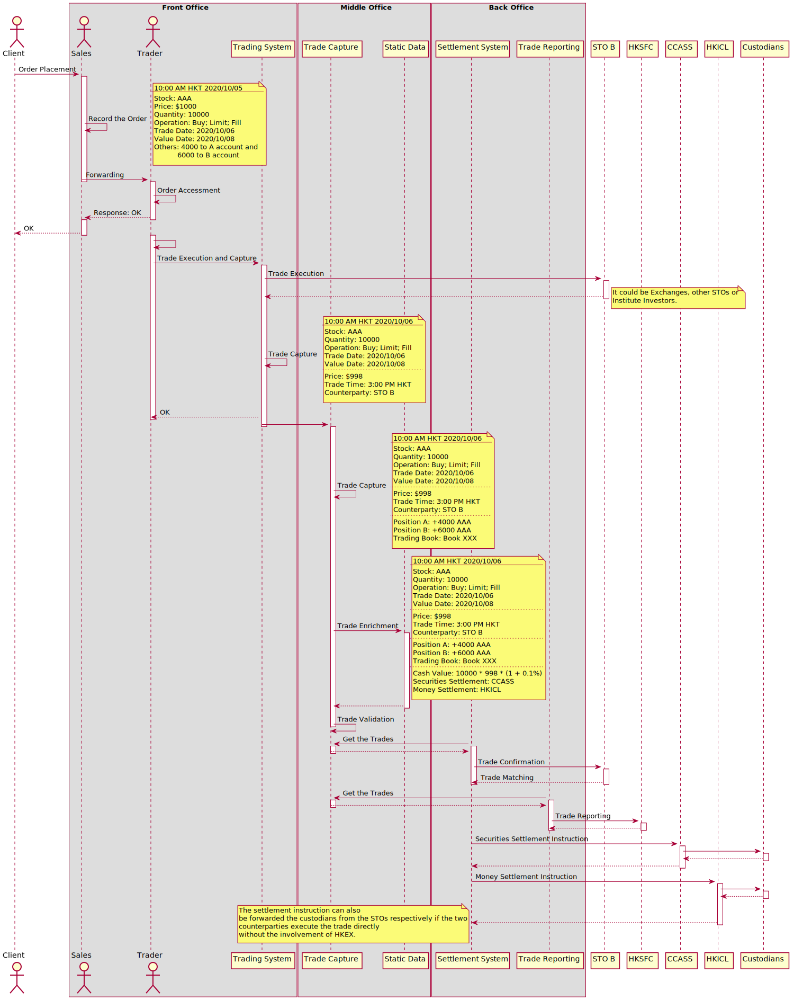

# Securities Operations

The flowchart is to deepen my understanding of the content in this book.

Note, 

1. Here the STO behaves as an agent, which doesn't hold the sold stocks beforehand.
2. Here the Client's account is open at the STO, which means the STO is helping in managing the position and cach for the client. It's possible that the client is an institute investor who has it's own custodian, in this situation the settlement between the STO and the client will be required.