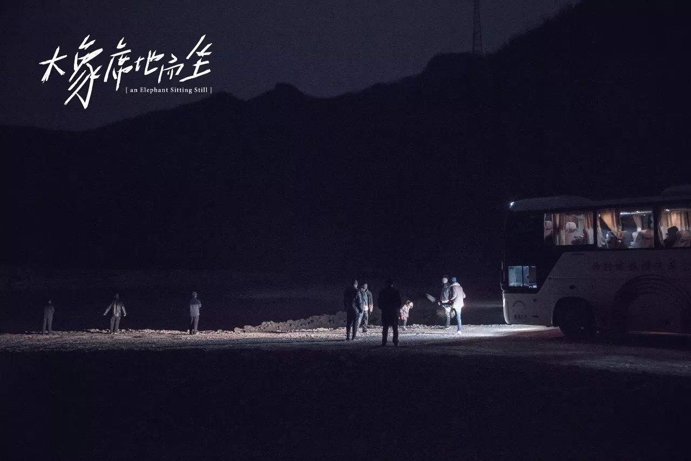

> 你知道满洲里吗？满洲里的动物园里有一头大象，它他妈的就一直坐在那，可能有人老拿叉子扎它，也可能它就喜欢坐在那，然后所有人就跑过去，抱着栏杆看，但有人扔什么吃的过去，它也不理。

> 有的时候你觉得那边很好，想过去看看。但是这个时候你不能过去，因为你要留在这里才能解决这里的问题。

> 其实人生最好的状态是，你站在这里，看着远方，感觉那里一定比这里好，而不要过去。

即使是好不容易鼓足勇气想要过去看看，

也可能因为奇奇怪怪的各种原因在路途中滞步不前，

却又退不回原点。

也许成长的过程就是失去的过程。