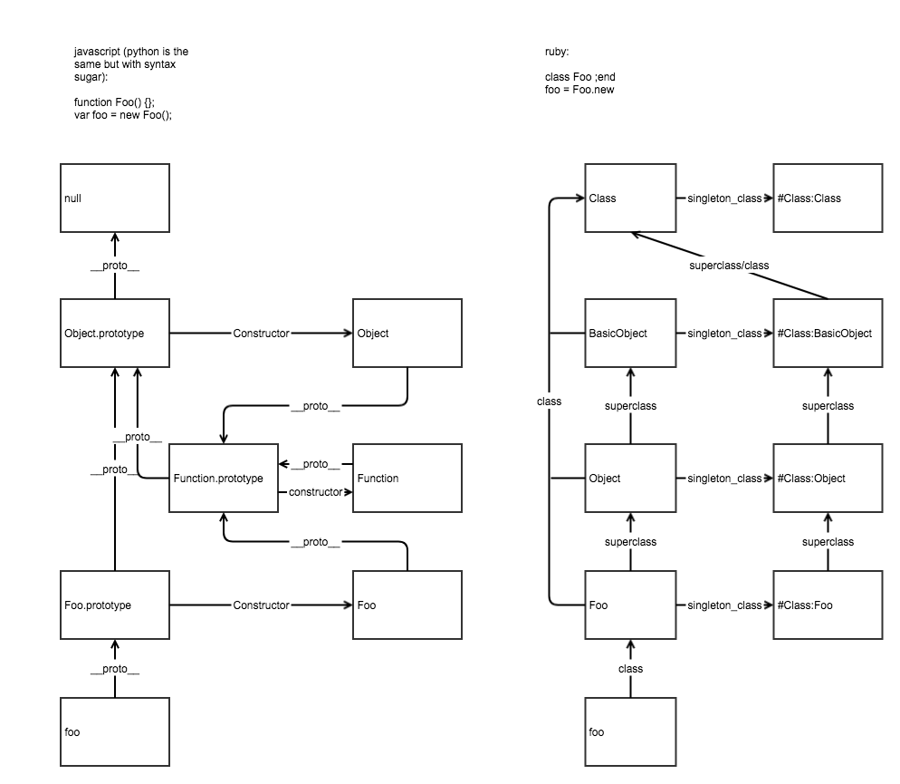

# JavaScript vs Ruby in Inheritance

> * Author: [Damon Yuan](https://www.damonyuan.com)
> * Date: 2017-09-14

Both JavaScript and Ruby have special inheritance model. In JavaScript, it is handled by stuff known as prototype chain; in ruby, there is a special class named as Singleton Class that wires all the magic up. The basic concept is the same: instance methods should be placed in 'Class' so that the instance can refer to it rather than duplicating it. Here is a diagram to clarify the inheritance chain in JS and Ruby and hope the comparison will shed some light on the common concept.

The new keyword in front of any function turns the function call into constructor call and below things occurred when new keyword put in front of function

- A brand new empty object gets created
- new empty object gets linked to prototype property of that function
- same new empty object gets bound as this keyword for execution context of that function call
- if that function does not return anything then it implicit returns this object.

Note: the foo object in ruby diagram also has an corresponding singleton class. And the `extend` key word is a short-cut to open the singleton class.
```
moddule m
// here is the module
// do whatever you want 
end

foo.exend m
```

```
foo.instance_eval do
// here the singleton class of object foo is open 
// do whatever you want 
end
```



By the way, [Metaprogramming Ruby 2](https://pragprog.com/book/ppmetr2/metaprogramming-ruby-2) is really great a book for rubyists.

#### Reference
- [What is “this” keyword in JavaScript](https://codeburst.io/all-about-this-and-new-keywords-in-javascript-38039f71780c)
- [All This](https://cooperluan.github.io/javascript/translation/2015/02/08/all-this-in-javascript/#function-this)
- [理一理js中让人抓狂的this](https://www.jianshu.com/p/adaf787a0d4d)
