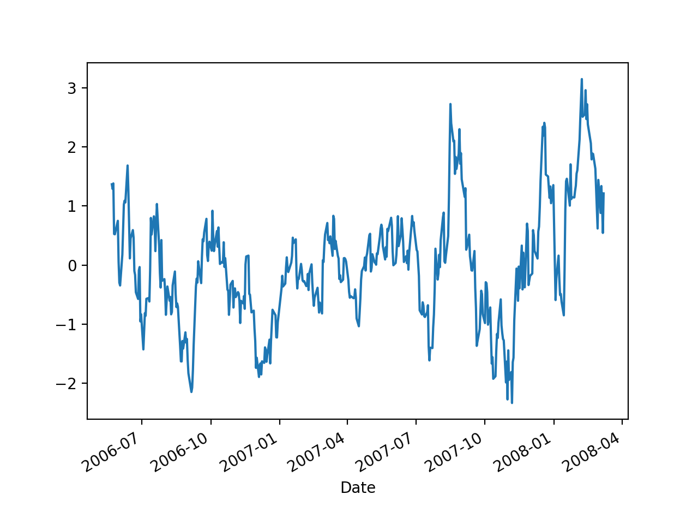
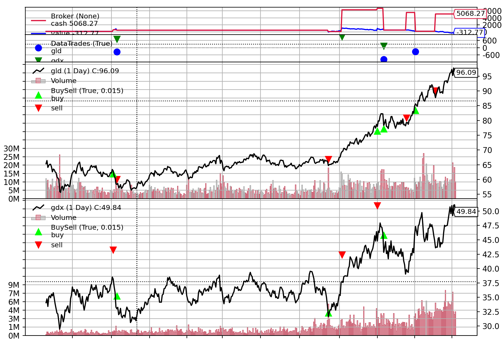

# 手动拆解《Quantitative Trading - How to Build Your Own Algorithmic Trading Business》（三）(下)

> * Author: [Damon Yuan](https://www.damonyuan.com)
> * Date: 2020-09-29
> * 微信公众号：[手动拆解《How to Build Your Own Algorithmic Trading Business》（三）(下)](https://mp.weixin.qq.com/s/sYrS_W62gpJ0g1MX-sZmMg)


第三章的基本结构如上。

这部分内容较多，分为上下两个部分。该部分为下。

### GLD 和 GDX 交易实例

GLD 是金价指数，GDX 是一篮子采金公司的指数。直觉上这两个指数应该是起头并进的，然而事实上这两只指数是均值回复(mean reverting)的关系。这部分的协整分析（cointegration analysis）会先放一边，在第七章会有详细解释，在这个例子中我们重点在训练样本上用回归测试（regression test）来决定这两个指数的套期保值比率（hedge ratio），然后为这个配对交易策略设置进入和退出门槛。

首先是获取数据和数据清洗。

这里补充以下 Yahoo 金融数据的获取，因为上一章介绍的其他三个方法都无法获得 GLD 和 GDX 的金融数据（尤其是 FUTU API, 会返回 [NN_ProtoRet_TimeOut](https://github.com/FutunnOpen/py-futu-api/issues/11)，不专业啊少年）。

```
from pandas_datareader import data
import backtrader as bt


class YahooDatafeed():
    def __init__(self, code, start, end):
        self.code = code
        self.start = start # '2006-01-21'
        self.end = end # '2009-12-21'

    def get_data(self):
        df = data.DataReader(self.code,
                               start=self.start,
                               end=self.start,
                               data_source='yahoo')
        df = df.rename(index={'Date': 'date'},
                       columns={'Open': 'open',
                                'Adj Close': 'close',
                                'High': 'high',
                                'Low': 'low',
                                'Volume': 'volume'})
        df['openinterest'] = 0
        print(df.head())
        return bt.feeds.PandasData(dataname=df.sort_index(),
                                   fromdate=self.start,
                                   todate=self.end)
``` 

我们按照之前提到的六步法来实现这个配对交易策略（Pair Trading Algorithm）。

#### 采集数据（collect）

按照上面提到的雅虎数据收集方法，进行数据采集，

```
   def collect(self):
        df = data.DataReader(self.gld_code,
                               start=self.start,
                               end=self.end,
                               data_source='yahoo')
        df = df.drop(columns=['Close'])
        self.gld = df.rename(index={'Date': 'date'},
                       columns={'Open': 'open',
                                'Adj Close': 'close',
                                'High': 'high',
                                'Low': 'low',
                                'Volume': 'volume'})
        print(self.gld.head())
        df = data.DataReader(self.gdx_code,
                             start=self.start,
                             end=self.end,
                             data_source='yahoo')
        df = df.drop(columns=['Close'])
        self.gdx = df.rename(index={'Date': 'date'},
                             columns={'Open': 'open',
                                      'Adj Close': 'close',
                                      'High': 'high',
                                      'Low': 'low',
                                      'Volume': 'volume'})
        print(self.gdx.head())
```

#### 数据清洗（prepare）

准备数据使其可以为 backtrader 所用，

```
    def prepare(self):
        '''
        该数据已经
        - 前复权
        - 有最高最低价及必要数据
          ['open', 'high', 'low', 'close', 'volume', 'openinterest']
        - 已经选好股票对象，不存在幸存者偏差问题
        但是需要
        - 找到两只股票交易日的交集
        - 交易日期按照升序排序
        - 添加 df['openinterest'] = 0，这个数据列是 backtrader 所需要的，我会另开
          一篇博客学习一下这个参数的意义
        - 将数据平均分为两部分，上半部分作为训练数据，下半部分作为测试数据
        '''
        intersection = self.gld.index.intersection(self.gdx.index)
        self.gld = self.gld.loc[intersection]
        self.gld = self.gld.sort_index()
        self.gld['openinterest'] = 0
        print(self.gld.head())
        self.gdx = self.gdx.loc[intersection]
        self.gdx = self.gdx.sort_index()
        self.gdx['openinterest'] = 0
        print(self.gdx.head())

        s = self.gld.index.size // 2
        self.gld_train = self.gld[:s]
        self.gld_test = self.gld[s:]
        self.gdx_train = self.gdx[:s]
        self.gdx_test = self.gdx[s:]
```

上面代码我已经添加注释说明我们具体需要做些什么。

#### 分析

这里我们需要理解一些概念，

- 线性回归（linear regression）
- Ordinary Least Squares（OLS）
- 损耗方程（cost function），最小二乘法（least square method）
- 梯度下降（gradient descent）
- 对冲指数（hedge-ratio）
- z-score, 用于量化一个数据同其样本平均值中的差距

因为不是数学或者金融课，这里就不一一讲解了。

总结一下这个 pair trading 例子是用线性回归的办法，利用 OLS 模型，使用最小二乘法这个数学优化建模方法建立损耗方程，通过梯度下降的办法求其最优参数，而且取参数中的斜率作为对冲指数（hedge-ratio）。通过这个对冲指数计算这对股票的差价（spread），如果高出一定差价则做空头操作，如果低于一定差价则做多头操作，若处于中间则做退出操作。

关于配对交易（pair trading）backtrader 有一片博文来解释同时也有一个详细的例子，但是和这本书里面的方法有些许不同。这本书中的方法用训练集算出的对冲指数是一个静态值，再用测试集验证其有效性。而 backtrader 中的例子通用计算移动平均线的方法来计算线性回归中的斜率使其动态化，我想这可能就是上一章所说的 parameterless trading framework。个人理解好处是能够使对冲指数反应指数变化从而自动作出调整，缺点是有可能过拟合。有兴趣的人可以查阅以下资料，

- [backtrader pair trading example](https://github.com/mementum/backtrader/blob/master/contrib/samples/pair-trading/pair-trading.py)
- [backtrader pair trading blog](https://www.backtrader.com/blog/posts/2015-09-03-multidata-strategy/multidata-strategy/)

我用 Python 实现了一下书中的 Matlab 代码，如下

```
    def analyze(self):
        train_feature = self.gdx_train['close'] # 获取特征值
        train_target = self.gld_train['close'] # 获取目标值
        train_feature = sm.add_constant(train_feature, prepend=False) # 注意如不加这句线性回归中的常量会被设置为0
        train_model = sm.OLS(train_target, train_feature).fit() # 利用训练集进行 OLS 线性回归
        train_predictions = train_model.predict(train_feature) # 获得预测值 
        train_hedge_ratio = train_model.params['close'] # 获得斜率也就是对冲指数
        train_spread = train_target - train_hedge_ratio*train_feature['close'] # 豁目标值与特征值对冲后的差价
        train_spread_mean = train_spread.mean() # 获取差价的平均数用于计算 z-score
        train_spread_std = train_spread.std() # 获取差价的标准差用于计算 z-score

        class GoldStrategy(bt.Strategy):
            # 这里我们设定如果 z-score <= -2, 做多
            # 如果 z-score >=2, 做空
            # 如果 |z-score| <= 1, 退场
            # 每次配对交易的资金量是 10000 美金
            params = (('longs', -2),('shorts', 2),('exits', 1),('portfolio_value', 10000))

            def __init__(self):
                self.buy_order = None # 配对交易中的多头
                self.sell_order = None # 配对交易中的空头
                self.gldclose = self.datas[0].close 
                self.gdxclose = self.datas[1].close

            def log(self, txt, dt=None):
                """
                Logging function for this strategy
                """
                dt = dt or self.datas[0].datetime.date(0)
                print('%s, %s' % (dt.isoformat(), txt))

            def next(self):
                spread = self.gldclose[0] - train_hedge_ratio*self.gdxclose[0] # 计算当日的差价
                zscore = (spread - train_spread_mean) / train_spread_std # 计算当日差价的z-score
                if self.buy_order and self.sell_order: # 如果已经有了订单
                    if abs(zscore) <= self.params.exits: # 查看有没有到达退场阈值
                        self.log(
                            'close the spread - gld close %.2f and gdx close %.2f' % (self.gldclose[0], self.gdxclose[0]))
                        self.close(self.datas[0])
                        self.close(self.datas[1])
                        self.buy_order = None
                        self.sell_order = None
                    return

                if zscore <= self.p.longs: # 查看有没有到多头阈值
                    self.log(
                        'buy the spread - gld close %.2f and gdx close %.2f' % (self.gldclose[0], self.gdxclose[0]))
                    sell_size = int(self.params.portfolio_value * 0.5 / self.gdxclose[0]) # 计算卖出特征值 GDX 数量，注意资金量需要乘以0.5
                    buy_size = int(self.params.portfolio_value * 0.5 / self.gldclose[0]) # 计算买入目标值 GLD 数量，注意资金量需要乘以0.5
                    self.sell_order = self.sell(data=self.datas[1], size=sell_size) # 先卖出特征值 GDX
                    self.buy_order = self.buy(data=self.datas[0], size=buy_size) # 再买入目标值 GLD
                elif zscore >= self.p.shorts: # 查看有没有到空头阈值
                    self.log(
                        'sell the spread - gld close %.2f and gdx close %.2f' % (self.gldclose[0], self.gdxclose[0]))
                    sell_size = int(self.params.portfolio_value * 0.5 / self.gldclose[0]) # 计算卖出目标值 GLD 数量，注意资金量需要乘以0.5
                    buy_size = int(self.params.portfolio_value * 0.5 / self.gdxclose[0]) # 计算买入特征值 GDX 数量，注意资金量需要乘以0.5
                    self.sell_order = self.sell(data=self.datas[0], size=sell_size) # 先卖出 GLD
                    self.buy_order = self.buy(data=self.datas[1], size=buy_size) # 再买入 GDX
                else:
                    return

            def stop(self):
                self.log('Ending Value %.2f' % self.broker.getvalue())

        return GoldStrategy # 返回策略
```

注意，一个潜在的用 backtrader 做回测的好处是你不需要把所有数据滞后一个 tick 时间，因为 backtrader 下单执行交易总是在下一个 tick（在书中作者用了一个 lag 函数来达到同样的目的）。

对上面的线性回归结果画图，
```
plt.scatter(train_feature['close'], train_target, color='black', s=1)
plt.plot(train_feature['close'], train_predictions, color='blue', linewidth=3)
plt.xticks(())
plt.yticks(())
plt.xlabel('GDX')
plt.ylabel('GLD')
plt.show()
```
结果如下，


这条线的应用意义就在于我们可以通过其预测符合线性回归的两只股票相对值的数值，如果实际上两只股票相对值偏差预测值太大，我们就认为存在套利空间，因为数学上我们认为迟早这个数值是会回归到预测值上的。

对对冲后的差价画图，

```
test = (train_spread - train_spread_mean) / train_spread_std
test.plot()
plt.show()
```



这种价差围绕着 0 上下往复的均值回复属性是我们的配对交易策略的基础，均值回复的幅度越大，频率越频繁，对我们的套利空间越有利。

#### 训练集回测

得到可用策略之后我们就可以把训练集代入 backtrader 中进行回测。用训练集进行回测的意义在于调节参数，我们再认为策略有理论基础的情况下，调节参数使其结果指数参数达到最优。

```
    def train(self):
        cerebro = bt.Cerebro() # 初始化引擎
        cerebro.adddata(bt.feeds.PandasData(dataname=self.gld_train.sort_index(),
                                   fromdate=pd.to_datetime(self.start),
                                   todate=pd.to_datetime(self.end)), name='gld') # 加入 GLD 数据
        cerebro.adddata(bt.feeds.PandasData(dataname=self.gdx_train.sort_index(),
                                   fromdate=pd.to_datetime(self.start),
                                   todate=pd.to_datetime(self.end)), name='gdx') # 加入 GDX 数据
        cerebro.addstrategy(self.analyze()) # 加入分析策略，注意上面 analyze 方法返回的是刚刚定义的策略类
        cerebro.addanalyzer(bt.analyzers.SharpeRatio, _name='SharpeRatio', riskfreerate=0.0) # 加入夏普比率分析指数
        cerebro.addanalyzer(bt.analyzers.DrawDown, _name='DW') # 加入回撤指标
        cerebro.broker.setcash(100) # 设置起始资金，注意我们的策略是货币中性策略，理论上不需要起始资金
        cerebro.broker.setcommission(commission=0) # 设置佣金为0
        results = cerebro.run(maxcpus=1) # 没有速度要求的情况下单核当线程运行避免一些不必要的线程问题
        strat = results[0] # 获取回测结果
        print('夏普比率:', strat.analyzers.SharpeRatio.get_analysis())
        print('回撤指标:', strat.analyzers.DW.get_analysis())
```

通过回测我们可以发现以下指标，

```
Hedge-Ratio: 1.9790671781349194
2006-09-05, buy the spread - gld close 63.36 and gdx close 38.49
2006-09-11, close the spread - gld close 58.50 and gdx close 33.28
2007-08-15, sell the spread - gld close 66.13 and gdx close 33.42
2007-09-06, close the spread - gld close 68.86 and gdx close 37.55
2007-10-31, buy the spread - gld close 78.62 and gdx close 46.40
2007-11-09, close the spread - gld close 82.18 and gdx close 46.13
2007-12-17, sell the spread - gld close 78.13 and gdx close 39.02
2008-01-02, close the spread - gld close 84.86 and gdx close 45.91
2008-02-04, sell the spread - gld close 89.10 and gdx close 44.89
2008-02-27, close the spread - gld close 94.78 and gdx close 49.57
2008-03-07, Ending Value -312.77
夏普比率: OrderedDict([('sharperatio', 0.14972505287365656)])
回撤指标: AutoOrderedDict([('len', 125), ('drawdown', 129.7882359706464), ('moneydown', 1362.7502174377441), ('max', AutoOrderedDict([('len', 248), ('drawdown', 138.48176286704742), ('moneydown', 10304908752441)]))])
```

与书中数据作对比差距还是比较大的，最后结果居然是亏的，暂时我没有发现为什么会有这个差距（可能是夏普比率计算方法，可能输数据所取的时间段和书中不同），我会在后续解读中慢慢分析，先不纠结这个了。

backtrader 还提供了画图功能,

```
plt.rcParams['font.sans-serif'] = ['SimHei']
plt.rcParams['axes.unicode_minus'] = False
plt.rcParams['figure.figsize'] = [9, 8]
plt.rcParams['figure.dpi'] = 125
plt.rcParams['figure.facecolor'] = 'w'
plt.rcParams['figure.edgecolor'] = 'k'
cerebro.plot(iplot=False)
```



#### 测试集验证

假定我们对训练参数所表现的结果是满意的，下一步就是用测试集数据验证这个策略是否真的有效还是只是数据的过拟合。这里我们需要做的只是把训练数据改成测试数据,
```
cerebro.adddata(bt.feeds.PandasData(dataname=self.gld_test.sort_index(),
                                   fromdate=pd.to_datetime(self.start),
                                   todate=pd.to_datetime(self.end)), name='gld')
cerebro.adddata(bt.feeds.PandasData(dataname=self.gdx_test.sort_index(),
                                   fromdate=pd.to_datetime(self.start),
                                   todate=pd.to_datetime(self.end)), name='gdx')
```

之后我们得到结果，
```
Hedge-Ratio: 1.9790671781349194
2008-03-10, sell the spread - gld close 95.87 and gdx close 47.94
2008-03-13, close the spread - gld close 98.34 and gdx close 52.26
2008-03-19, sell the spread - gld close 93.04 and gdx close 46.03
2009-12-21, Ending Value -838.18
夏普比率: OrderedDict([('sharperatio', -0.5109222191683993)])
回撤指标: AutoOrderedDict([('len', 278), ('drawdown', 174.82611759058264), ('moneydown', 1958.349838256836), ('max', AutoOrderedDict([('len', 278), ('drawdown', 232.69145403451998), ('moneydown', 2606.5400161743164)]))])
```

Hedge-ratio 不变，因为我们还是用训练集得到的参数，然后我们发现夏普比例，回报都比训练集中的结果差，这个时候我们就需要反思策略思路和策略实现的正确性。


最后作者还验证了我们的策略没有包含未来函数。他的做法和上一篇文章提到的一样，去掉测试集中最近的60天的数据，再对新的测试集进行回测，然后对比之前测试集的回测仓位。如果没有未来函数，在60天前这两次回测的仓位应该是完全一样的。鉴于文章篇幅，我这里就不再实现了。

### 敏感性分析（Sensitivity Analysis）

这个分析主要目的是避免策略数据过拟合。如果改变参数对回测结果影响巨大，那么说明我们的策略很有可能对数据进行了过拟合，那这个策略是不可用的。

原则上我们应该尽可能在不影响测试回测结果的条件下，减少策略中的条件，限制和参数，即使这有可能导致训练回测的结果变差。

## 第五部分 TRANSACTION COSTS

交易费用由很多种，

- 佣金（commission）
- 流动成本（liquidity cost）
- 机会成本（opportunity cost）
- 市场影响（market impact）
- 滑点成本 (slippage)

这部分作者用了一个均值反转模型来证明交易费用对策略有效性的影响，处于篇幅考虑这里就不再用 backtrader 复现了，但是这里推荐一篇类似文章 - [Backtesting a Cross-Sectional Mean Reversion Strategy in Python](https://teddykoker.com/2019/04/backtesting-a-cross-sectional-mean-reversion-strategy-in-python/)，有兴趣的读者可以查阅。

总而言之作者想传达一个信号，在考虑交易费用的情况下很多看似可行的交易策略都会无效。

## 第六部分 STRATEGY REFINEMENT

这一部分简要讲述了一些策略优化的方法。优化策略在不适当的情况下可能会引入数据过耦合，优化的原则和参数优化原则相似，都是**必须保证优化后，测试集回测能达到同训练集回测类似的获利表现提升**。

一些简单的策略可能看似再也无法获利了，毕竟太多人在利用它获利，事实上加入一些简单的改动就有可能让它重新发挥作用，比如

- 有的交易员会把医药股从他的量化组合中剔除因为股价受消息影响太大
- 出于同样的原因，有的交易员会把有并购或者收购可能的公司股票剔除
- 其他交易者会更改交易进入和退出的时间或频率
- 还有一些策略在科创版上可能会有很好的表现，在 A 股市场可能就不太能获利

## 总结

这里我觉得有一句话值得再提一下，量化交易是在分析过往数据，期望从中找出规律并利用其获利的一种策略。为什么提这个，因为在日常生活中我们会听到无数的反对声音告诉我们这种策略是无效的，人没有办法遇见未来。我个人意见是在数据量足够大，交易足够迅速的情况下，量化自动化交易无论在效率上还是风控上都从整体高于个人，何况交易策略的主体还是个人 - 如果一个人有足够的能力在不用量化交易的情况下分析各种条件获利，量化只会是他更好的工具去创造更大的获利空间。