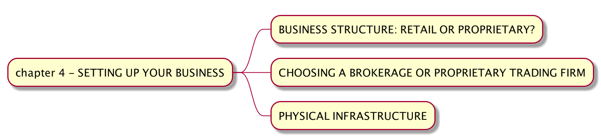

# 手动拆解《Quantitative Trading - How to Build Your Own Algorithmic Trading Business》（四）

> * Author: [Damon Yuan](https://www.damonyuan.com)
> * Date: 2020-10-01
> * 微信公众号：[手动拆解《How to Build Your Own Algorithmic Trading Business》（四）](https://mp.weixin.qq.com/s/ToXR5yfqfs-flvnLx9Pibw)

第三章花了好多时间讲了回测这个重要的概念，脑细胞死掉了不少，更可怕的是头发也掉了很多。这个梗虽然都被玩烂了，但是我还是想玩一下。

感谢作者第四章给了我们休息的机会，不是那么硬核了（别杠，杠就你对）。

这章跳出了技术角度，从业务角度来分析了几个开展交易业务前的重要步骤：开哪种账户，需要哪些功能，还有接入哪个实体系统进行交易。

首先是开个人账户还是加入一家专门的交易公司账户。这是我们需要考虑的问题吗？

作者这里遇到的情况和中国甚至香港市场都有很大不同，虽然不同的市场对个人投资者都有各式各样的限制，但是大体上这些限制或者说信息的不对称都是在慢慢宽松或者减少。对于作者说的加入一家 Trading Company，大家看看就好了，99% 的人都没有他的学历，工作经验来支撑他随便跳到一家交易公司的，呵呵🙃。

下一个问题。

什么？还是问你用个人交易账户还是加入一家公司用公司账户？我们当然知道公司账户佣金低，但是这个差距也在逐渐减少，像下面这种交易费率已经是相当普及的了，

除非是超高频策略，我想不出什么理由在佣金角度个人投资者会有多大劣势。

但是需要注意的是机构相对于个人有许多特别的功能。比如这里提到了一个 "Dark-pool liquidity" 的概念，我的理解是各种机构内部组成的一个交易系统，相当于地下钱庄，所以这里的交易订单是不会在股市上出现的。我不知道现在是不是还有这个功能，或者是不是香港大陆机构也有这个功能，但是大机构肯定有小散看不到的优势。

不过，这些和大多数韭菜，似乎也没有什么关系。这部分我们就不再纠结了，留给韭菜的选择不多🙅‍。

第三部分。。。告诉你要有好的电脑，好的网络，等等。。。重要但是挺无聊的。

就酱。

