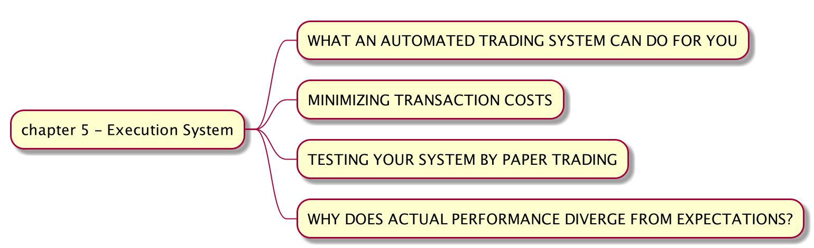

# 手动拆解《Quantitative Trading - How to Build Your Own Algorithmic Trading Business》（五）

下一步我们要做的就是把经过回测验证的策略投入到实际交易系统，我们将会接入的系统是富途牛牛。

第一部分介绍自动化的交易系统能做什么。这本书是2007年出版的，很多技术手段都已经老旧了。现在很多的交易软件都提供有 API，我们这里将使用[富途牛牛](https://github.com/FutunnOpen/py-futu-api)。富途牛牛提供了两个账号：一个真实账号，另外一个是虚拟账号。这里我们可以先用虚拟账号接入，在确认一切测试完美之后才进行真实账号交易。

第二部分介绍如何降低交易费率。如上一篇所说，现在的交易费用已经降低了非常多，如果不是高频交易，交易费用对获利的影响不大。作者另外提到一个订单大小问题，他认为每一个订单不应该超过每日交易量的百分之一。

。。。我觉得对于大部分的证券市场我都没有问题。。。当然如果你交易市场流动性不佳，那还是要小心点的。

第三部分说用 [Paper Trading](https://www.investopedia.com/terms/p/papertrade.asp#:~:text=A%20paper%20trade%20is%20a,risking%20money%20in%20live%20markets.) 来验证策略。例如富途牛牛有虚拟账号，我们可以直接接入然后测试。

第四部分讲如何在期望和实际利润偏差过大的时候找到原因。这里罗列了一些可能的原因，而实际上可能的原因比这些多了太多所以我不一一列举额的，具体情况具体分析。

因为一章的内容和当今的科技发展相比落后了太多，接下来我们来看如何在 backtrader 中接入富途牛牛。

首先我们来看一种简单的办法, 一般我们会在 backtrader Strategy `next()` 判断是否需要生成订单。我们可以每天在收市后，收集最新的数据，运行回测。如果有生成订单，我们就可以调用富途牛牛 API 提前生成相应的订单，在第二天会自动执行。在之后的回测中，把订单结果录入到 backtrader 中。

步骤为，

- 1）每天在收市后，收集最新的数据，运行回测
- 2）检查 backtrader Strategy `next()` 判断是否需要生成订单
- 3）如果有生成订单，我们就可以调用富途牛牛 API 提前生成相应的订单，在第二天会自动执行。
- 4）在之后的回测加入现有订单。

另外一种复杂的方法是利用 backtrader Live Trading 的概念集成 FUTU API。backtrader Live Trading 集成主要由 3 个 class 组成：broker, data 和 store。最近进度有点慢，主要就是在理解 backtrader 源代码，之后会开源此部分(meta programming in Python 有点蛋疼）。